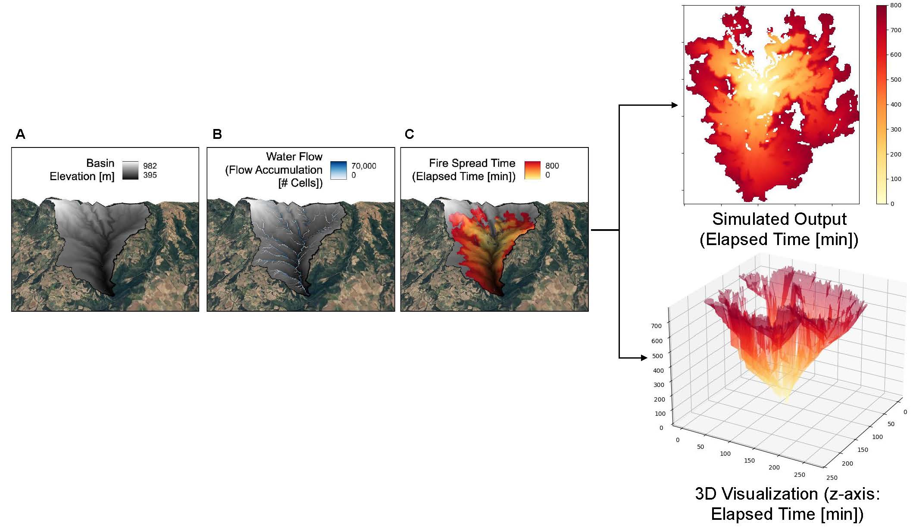
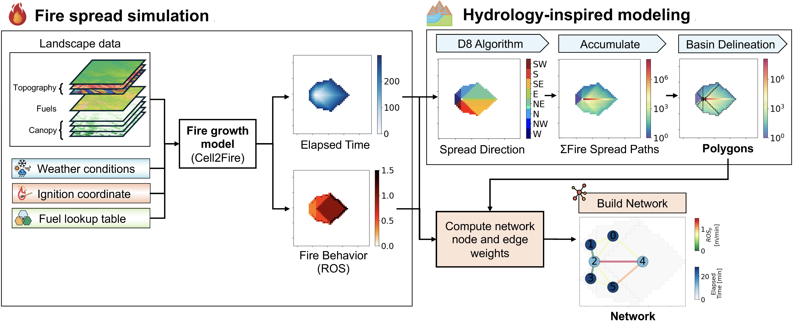

# Modeling fire potential polygon networks for fire suppression decision-making using fire spread simulations and hydrology tools 🔥
Collaborators: [Minho Kim](https://minho.me), Marc Castellnou, [Marta C. Gonzalez](https://scholar.google.com/citations?user=YAGjro8AAAAJ&hl=en)

Abstract
---------------------
Climate change has intensified fire-conducive weather conditions, leading to catastrophic wildfires and overwhelming suppression efforts. Traditionally, fire management has been reactive to these risks, straining resources and reducing suppression efficiency. In response, the Catalan Fire Service pioneered an innovative approach to guide proactive fire management, manually drawing polygons of fire potential and connections using expected fire behavior on the landscape. However, this manual drawing process is time-consuming, subjective, and relies heavily on expert judgment. To address this limitation, we introduce a method to automatically generate fire potential polygons and connect them into a weighted network based on fire behavior. To this end, we use a cellular automata-based 2D fire growth model under dynamic weather conditions to simulate fire behavior. We calculate the elapsed time computed from fire spread simulations and propose a method inspired by basin delineation tools from hydrology to segment polygons on the landscape. These polygons are subsequently connected into a network, using a weighted rate of spread metric to characterize the connections. Our method produces automated polygons, networks of the polygons connected by various fire behavior metrics, major fire pathways, and network visualizations of simulated scenarios. 

 

  
   <i>Visualization of elapsed time from fire spread simulations (A) Selected drainage basin shown with elevation [m]. (B) Water flow represented by flow accumulation overlain on basin elevation. (C) Elapsed time during fire spread (i.e., time elapsed since ignition in minutes) rasterized from Cell2Fire’s simulated output and overlain on basin elevation.</i>

We validate our approach on two wildfire case studies in Catalonia (Spain) during the 2024 fire season. Our approach is applied during the initial attack of two fires that had the potential to grow large with a high risk of invoking catastrophic damage. In the wind-driven Ciutadilla fire, the polygon networks were able to identify high-risk polygons, connections, and critical fire pathways that aligned with real operations on the ground. In the Vilanova fire, we present how our modeling approach can integrate various suppression tactics and a prescribed burn to update the networks and assess the amount of time gained through the suppression. Our results reveal that implementing the proactive tactics yields substantially more time and effectively slows fire progression. Through this study, we demonstrate that our approach expedites the original  process and provides essential information to support decision-making during fire suppression. As wildfires continue to threaten our built and natural environments, our proposed method can be integrated into existing risk-based frameworks and can be used by various fire services around the world to streamline fire management and response. 

 

  
   <i>Diagram of proposed methodology using fire spread simulations and hydrology-inspired modeling of fire potential polygons to build fire potential networks for decision support.</i>

Highlights
---------------------
* Fire potential polygons are an innovative approach for wildfire risk management.
* Automatically generated polygons using fire spread simulations and hydrology-based basin delineation tools.
* Constructed networks of polygons that prioritize suppression efforts and enhance decision-making.
* Evaluated our method in real-time initial attack operations for two key wildfires in Spain.

Contents
---------------------

 

  
   <i>Diagram of proposed methodology using fire spread simulations and hydrology-inspired modeling of fire potential polygons to build fire potential networks for decision support.</i>

Highlights
---------------------
* Fire potential polygons are an innovative approach for wildfire risk management.
* Automatically generated polygons using fire spread simulations and hydrology-based basin delineation tools.
* Constructed networks of polygons that prioritize suppression efforts and enhance decision-making.
* Evaluated our method in real-time initial attack operations for two key wildfires in Spain.

Contents
---------------------

Citation
---------------------
**Please cite the journal paper if this code is useful and helpful for your research.**
